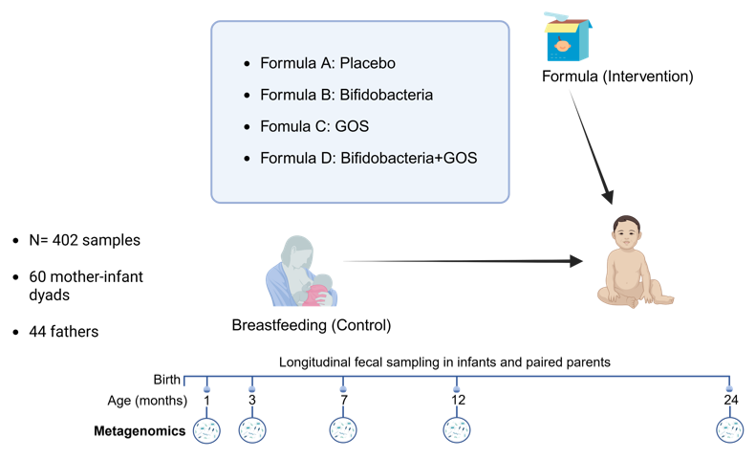
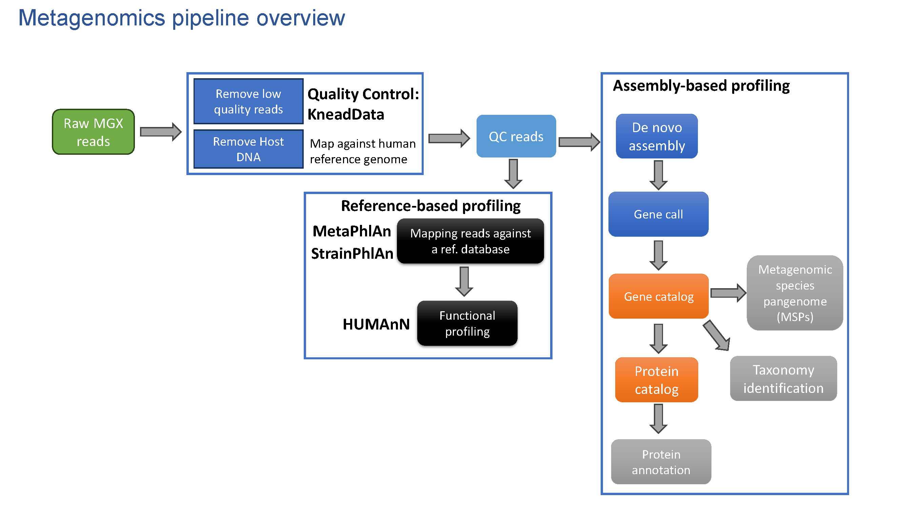

# Infantibio-II follow-up study design 

Previous shallow metagenomic sequencing of samples from 3- and 7-month-old infants in the Infantibio-II infant cohort had revealed species-level differences between breast-fed and formula-fed infants[(Heppner et al., 2024)](https://doi.org/10.1016/j.chom.2024.02.015). To investigate these differences at much higher resolution, we selected a longitudinal subset (n = 402 samples) which included five time points (1, 3, 7, 12, and 24 months of age) for deep shotgun metagenomic sequencing and downstream analyses. This enabled strain-level resolution, vertical strain transmission analysis, and functional profiling. One sample was excluded during QC due to host read contamination above threshold limit, resulting in a final dataset of 401 samples. This subset comprised 59 samples at 1 month of age, 59 at 3 months, 60 at 7 months, 59 at 12 months, and 60 at 24 months of age, along with paired parental samples collected when the infants were 1 month old (60 from mothers and 44 from fathers).

Schematic of the Infantibio-II interventional trial design and sample selection for strain-level metagenomic analyses (follow-up study). Illustrates the randomized formula interventions: placebo (formula A), supplemented with bifidobacteria (formula B), supplemented with GOS (formula C), or supplemented with both GOS and bifidobacteria (formula D), with breast-fed infants as a control. Selected sampling time points for metagenomics sequencing and subsequent analyses include: 1 month, 3 months, 7 months, 12 months, and 24 months, with paired parental samples at 1 month of age: 60 mothers and 44 fathers.

# Deep Shotgun Metagenomics Analysis Pipeline and Downstream Analysis

## Requirements

### Reference-based tools:

* KneadData v 0.10.0 [(KneadData)](https://github.com/biobakery/kneaddata)
* Trim Galore v 0.6.10 [(Trim Galore)](https://github.com/felixkrueger/trimgalore)
* MetaPhlAn v 4.1.1 [(MetaPhlAn)](https://github.com/biobakery/MetaPhlAn)
* StrainPhlAn v 4.1.1 [(StrainPhlAn](https://github.com/biobakery/biobakery/wiki/strainphlan4)
* HUMAnN v 3.6 (with MetaPhlAn 3.1.0 output) [(HUMAnN)](https://github.com/biobakery/humann)

### Assembly-based tools:

* MEGAHIT v 1.2.9 [(MEGAHIT)](https://github.com/voutcn/MEGAHIT)
* Prodigal v 2.6.3 [(Prodigal)](https://github.com/hyattpd/prodigal)
* cd-hit v 4.8.1 [(cd-hit)](https://github.com/weizhongli/cdhit)
* MSPminer [(MSPminer)](https://academic.oup.com/bioinformatics/article/35/9/1544/5106712?login=false)
* InterProScan v 5.55_88.0 [(InterProScan)](https://github.com/ebi-pf-team/interproscan)

## In-house custom scripts for the tools used in the pipeline include:

- `metaphlan4_subsp_longum_infantibio.sh`
- `strainphlan_extract_markers.sh`
- `strainphlan_sample2markers.sh`
- `strainphlan_main.sh`
- `strainphlan_add_metadata.sh`
- `strainphlan_graphlan.sh`
- `global_Bifidobacterium_strain_diversity_trees.sh` (for global Bifidobacterium strain diversity analysis with StrainPhlAn)
  - used the `make_annotation_file_ALL.py` python and `total_metadata_merged_ALL.txt` excel files.
- Additional reference-based tools (KneadData, Trim Galore and HUMAnN) and assembly-based tools (MEGAHIT, Prodigal, cd-hit, MSPMiner, and InterProScan) were executed using an in-house pipeline implemented in Snakemake v 7.26.0.

## Downstream analysis

### Alpha- and Beta- diversities (overall species-level microbiome composition)

For alpha-diversity and beta-diversity analysis we used the R script named `Diversities.R`. For this script we needed to install the R packages "vegan" and "ggplot". We also needed two input files, A) a MetaPhlAn output table with relative abundances where the bacterial species are in the columns and the samples are in the rows (the `merged_abundance_table_species_transposed.txt` file is our original output table with MetaPhlAn4 species-level taxonomic profiles and was used for this purpose), and B) a mapping file (`mapping_file.txt`) with all the relevant metadata as columns and the samples in the rows.

### Dominant genera (genus-level)

For visualizing the median relative abundances of top bacterial genera as stacked barplots we used the Jupyter script `top_genera_stacked_barplots.ipynb`. We only needed one input file, which is a MetaPhlAn output table (transposed) with the taxonomic relative abundances at the genus-level as values, the bacterial genera as columns and the samples as rows. We used the table included in the `merged_abundance_table_genus_transposed.txt`. If not, your own MetaPhlAn transposed table with the added metadata info as columns can also be used.

### Top Bifidobacterium species

For generating the relative abundances of the dominant Bifidobacterium species by formula group we used the Jupyter script `Bifidobacterium_boxplots_by_formula.ipynb` file. As previously, we needed the `merged_abundance_table_species_transposed.txt` as input file (table with the species-level relative abundances). This table includes both species names and metadata in the columns and the samples names in the rows.

### Bray-Curtis dissimilarity heatmap at 24 months

For the Bray-Curtis dissimilarity heatmap at 24 months the Python script `bray_curtis_heatmap.py` was used with the same `merged_abundance_table_species_transposed.txt` input file as mentioned before.

### Strain Diversity Analysis

To generate these trees we used the StrainPhlAn tool with each step in each separated script. We started with `strainphlan_extract_markers.sh` to extract reference species-specific marker genes (from the desired clade) from the MetaPhlAn database and `strainphlan_sample2markers.sh` to reconstruct consensus marker sequences for every species/strain detected in each metagenomic sample. The `strainphlan_main.sh` was the main script and constructed the phylogenetic tree. Then, the script `strainphlan_add_metadata.sh` added sample metadata to the tree while `strainphlan_graphlan.sh` was used for visualization and for generating the final figures.

### Strain Diversity Analysis of Bifidobacterium dominant species in a Global Reference Database

For the global Bifidobacterium strain diversity analysis with StrainPhlAn we used the file named `global_Bifidobacterium_strain_diversity_trees.sh` and followed the steps included there (using the StrainPhlAn tool, similarly to the step before).

### Multivariate association analyses with Maaslin2 for functional profiling (HUMAnN3 data: unstratified; gene families / gene pathways)

For the multivariate association analyses using Maaslin2 (with Humann3 data) the R script named `maaslin.R` was used. For this purpose the Maaslin2 R package had to be installed with BiocManager. Two input files were required: a table with all the gene families/pathways abundances (`genepathways_unstratified.txt` or `genefamilies_unstratified`), and a mapping file. Sample IDs had to match between these two files.

### Volcano plots for visualization of significant HUMAnN3 gene families / gene pathways from Maaslin2 output

For the volcanoplots with Humann3 functional profiles (gene families or gene pathways), the R script `volcanoplots.R` was used. The Maaslin2 output file with the significant gene families/pathways (filtered by the associated ones to your desired variable; e.g., feeding) was used as input file.

### Analysis of top ranked annotated genes (de-novo assembly data) significantly different between BL subsp. infantis cluster 1 and cluster 2 (strain-level analysis)

For the BL subsp. infantis horizontal barplots with the top significant annotated genes, the script `BLinfantis_clusters_top_genes_barplots.py` was used. Input files were: A) a Maaslin2 output file with the significant genes associated with the relevant variable (e.g., clade or cluster), and B) an output file from InterproScan with the annotated Pfam domains.

### Visualization of StrainPhlAn4 strain evolutionary distances (for selected species) from infant to paired parents: related vs unrelated; impact of feeding

For the evolutionary distances we used the Python script `evolutionary_distances.py` and two input files. The first input file was a "full symmetric distance matrix" table (e.g., `buniformis_full_symmetric_distance_matrix.txt`) for each bacterial species where sample names are included as row names AND columns. Values were evolutionary distances between samples according to the StrainPhlAn distance matrix output (Kimura-corrected). The second file (e.g., `buniformis_with_distances_to_parents.txt`) was a table with the samples as rows and the "Distances_to_mother" and "Distances_to_father" as two separate columns with the evolutionary distances values from each infant sample to the respective mother or father.

## Data availability

Metagenomic reads have been deposited at the NCBI Sequence Read Archive (SRA) through SRA Bioproject ID PRJNA1491085 and SRA submission ID SUB16306007.

## Authors

- Michael A. Vig Merino - Main author - TUM - michael.vig@tum.de; michael.vig.merino@gmail.com - [ORCID](https://orcid.org/0009-0004-3180-8480)
- Svenja Weißenberger - TUM - svenja.weissenberger@tum.de - [ORCID](https://orcid.org/0009-0009-4374-0360)

## Citation

If you use this code, please cite:

**Preprint:**

Merino MV, Weißenberger S, Ermolova A, Dhilly E, Spadazzi R, Levy L, Collado MC, Hertz T, Omer H, Heidrich V, Segata N, Larsen M, Schirmer M, Haller D. Probiotic formula intervention in infants leads to colonization and competitive strain displacement independent of IgA binding. bioRxiv (2026). https://doi.org/10.64898/2026.06.03.729775

